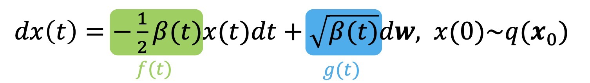

```table-of-contents
```

# Probability Flow ODE (Intro)
- 목표 : DDPM, DDIM 방식보다 빠르게 생성하자 


## Previous 
### Forward Process

- ### Forward Process의 SDE 표현식 (continuous time domain)
	- 모든 forward process는 대응되는 SDE가 존재
	- $$dx(t) = \textcolor{blue}{f(t){x(t)}dt} + \textcolor{red}{g(t)dw},\space  x(0)~q(x_{0})$$
	-  파란색 : Drifting Terms 
	- 빨간색 : Diffusion Terms (noise를 추가하는 의미)
	- dw: Brownian motion


### Reverse Process
- Reverse Process 또한 SDE로 표현이 가능하다. 
- 유도는 우선 생략 


### Forward


### Wiener Process
- dw의 process 
	- 아래의 4가지 조건 존재 

### Variational Diffusion Models
- Diffusion Model의 일반화! 
	- 아래의 수식을 만족하면 Diffusion Model이다 
	- $$q(x_{t} | x_{0}) = \mathcal{N}(x_{t}; \alpha(t)x_{0} , \sigma^{2}(t)I , \space SNR = \frac{\alpha^{2}(t)}{\sigma^{2}(t)} monotonically \space decreasing)$$

### SDE-> Diffusion Model
SDE : $dx(t) = f(t)x(t)dt + g(t)dw$
> forward Diffusion Model 
> $q(x_{t}| x_{0}) = \mathcal{N}(x_{t}; \alpha(t)x_{0} , \sigma^{2}(t)I)$


### Diffusion Model -> SDE 

- 위에서 $\alpha(t)$ 와 $\sigma^{2}(t)$ 를 미분한 것
	- $g^{2}(t)$ 는 그대로 받아들이자.
	-  결론 
		- $$ f(t) = \frac{d\log\alpha(t)}{dt} $$
		$$g^{2}(t) = 2\sigma^{2}_{t}(-\frac{d\lambda_{t}}{dt})$$
		  

### VP-SDE vs VE-SDE
-  Forward를 어떻게 정의하냐에 따라 SDE 식이 달라짐
	1. DDPM Forwarding <=> VP-SDE
	2. SMLD(Score Matching) <=> VE-SDE
  
- ==아래와 같이 Diffusion 함수를 정의하자!== 
	- 유도는 시간될 때 찾아보기 
	- $\beta(t)$는 시간에 따라 증가하므로 $\alpha(t)$ 는 증가, $\sigma(t)$는 감소하여 SNR은 감소! 
	  General Diffusion 정의를 만족!

- 대응되는 SDE 
	- 
	- 유도 과정은 아래 참고 
	- 

# Probability Flow ODE 
> 요약! 
>1. Reverse Process의 ODE 식에 
>2. Variance Preserving Forwarding ODE의 f(t), g(t)를 대입
>   => Reverse Process 대신 대응되는 ODE를 풀자! 
>  [풀어야 할 식] Reverse Procecss ODE 
>   
- 모든 SDE는 대응되는 ODE가 있음. 
  시간 t마다 marginal dist가 같음.
- 빨간색이 SDE
  하얀색이 ODE 
  -> ODE가 더 명확하고 직선적으로 목표에 도달하기에 효율적임


- Reverse Process의 SDE는 다음과 같은데 
  ODE의 경우 SDE에 존재하는 $dw_{t}$ 항이 없다! 


- 위 식에 아래의 f(t), g(t)를 대입 
	- ==$X_{T}$ 만 주어지면 x(t) = 경로를 찾을 수 있다.== 
		- $\alpha_{t}$, $\sigma_{t}$, $\lambda_{t}$  는 사전에 정의된 $\beta{t}$ 로 정의가 되고 
		  $\epsilon(t)$ 는 noise predicting network로 구함! 


> 참고 : Song et al., Score-Based Generative Modeling through Stochastic Differential Equations, ICLR 2021.

### ODE 푸는 기존의 방법론


### Dedicated Solver?
- 위의 일반적인 ODE풀이법이 아니라 Diffusion Model(Reverse Process) ODE에 특화된 solver가 있나? 


# ODE 
### First-order Linear Differential Equation 

- ==First-order :== 
  x에대해 Linear하고 
  t에 대해 미분가능한 일반적인 형식 


- ==q(t) = 0 일 경우==
	

	 
	


- ==일반적인 경우== 
	- q(x(t), t) 는 x에 대해 Linear하지 않을 수 있다. 


	> **결론!** 
	> 
	
-  경험적으로 아래의 수식을 곱해서 정리! 


# DPM-Solver 
> 요약
> Reverse Process ODE는 first-order semilinear ODE라서 
> 위의 방식대로 풀어주면 
> Dedicated Solution을 구할 수 있다. 
> 결론! 
> [Continuous] 
> [Discrete]
> 


1.  first-order semilinear ODE 해에 Reverse Process ODE의 p(t) , q(t)를 대입


2. 적분항의 변수를 t에서  $\lambda$ 로 변경
3. [Discrete 버전] s에 t+1을 대입 + noise prediction이 구간 내에서 상수라고 가정해 
discrete로 변경 


4. 일부 항 $h_{t} = \lambda_{t} - \lambda{t+1}$ 로 변경 

- DDIM과 연결성 
	- DDPM ODE 결론식
	
	- DDIM Reverse Process에 t -> t+1로 대입해서 정리하면 DDPM ODE와 식이 같아짐 


- ==이후 DPM-Solver2 / DPM-Solver n 은 나중에 정리!==