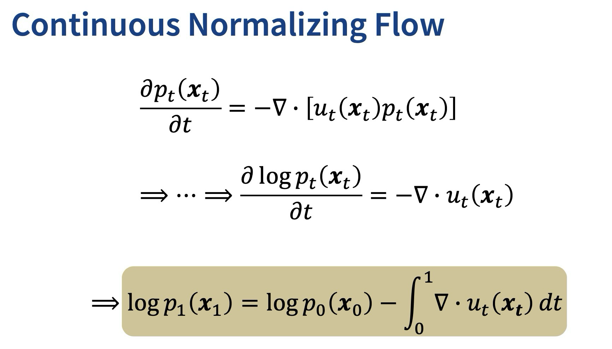
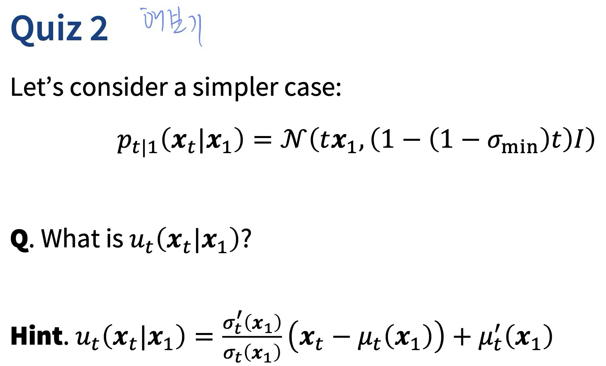
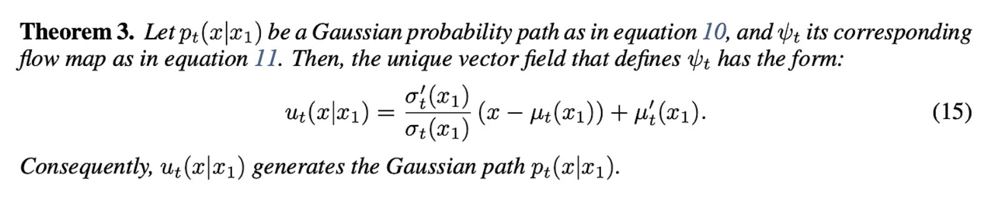

```table-of-contents
```

# 이전 내용

### Fokker-Planck 방정식
- 이전 Lecture14에 나온 SDE->ODE의 근간이 되는 방정식


# Flow-Based Models

### Flow Matching
- 기존 Diffusion Model의 경우 여러 TimeStep을 거쳐 훈련시간이 길고 
  복잡한 이미지 분포->정규분포->복잡한 이미지 분포로 이동하는 방식이 정해져있어 
  데이터 분포의 다양성을 제대로 표현하지 못함
- Continuous Normalizing Flows(CNFs)사용 
	- 임의의 확률 경로를 모델링 가능
	- 효율적인 학습 방법인 Flow Matching 도입
	  Flow Matching: 목표 vector field를 따라 확률 경로를 생성하도록 CNF의 vector field를 학습시키는 방식

### Probability Path vs Vector field vs Flow
- Vector field : 데이터가 얼마나 어느 방향으로 이동할 지를 나타내는 정보
- 그림에서
	- f 함수 : vector field
	- 회색 화살표 : probability path
	- 그림 전체 : flow 


- ==Flow Matching에서 표기법은 약간 다름== 
	- $x_{0}$ : N(0,I)
	- $x_{1}$ : data dist (원본 이미지)


# Normalizing Flow
> 요약 
> Reference dist(N(0,I)에서 sampling 분포로 변환시키자
> -> 변환하는 식! 

- $\phi$ : 연속, 미분가능함수
  역함수가 존재하고 역함수도 연속, 미분가능 


- 변수변환! 
	- Q : 어떻게 $p_{0}$ 분포에서 샘플링하여 $p_{1}$ 분포로 매핑할 수 있을까?
	- A : ==1. $p_{0}$에서 sampling 2. push-forward 함수로 매핑== 
	- -> 수식 상 변수를 같은 $x_{1}$ 로 맞추기 위해 변수변환이라는 방식을 사용


- 예시
	- $p_{0}$ : Gaussian
	- $\phi$ : 선형 변환
	- $p_{1}$ : Gaussian의 선형변환


- $p_{1}$  분포에서 $x_{1}$ 이 주어졌을 때 아래의 목적함수로 $\phi$ 함수를 학습시킬 수 있다! 
	-  Prob : 어떻게 $\phi$ 를 학습시키고 역함수를 계산할 것인가? 
	  Jacobian을 어떻게 계산할 것인가? 


# Residual Flow
> 변환함수를 여러 함수로 나눠서 정의
> ->변환하는 식! 
> -> 한계 : ODE를 푸는데 시간이 걸린다

- $\phi$ 를 Discrete한 여러 Time domain으로 나누자


## Continuous Normalizing Flow 

- time step(T)가 무한대로 가면 시간 간격은 0에 가까워지고
  1 step의 $\phi_{t}$  와 이전 $x_{t}$ 와의 변화량은 ODE를 따른다.
- 이를 풀어 $x_{0}$ 에 따른 $x_{t}$ 를 구해주자! 
	- Fokker Planck 방정식을 통해 구함! 

- ==<span style="background:#ff4d4f">Fokker Planck 방정식 의미?</span>

- <span style="background:#ff4d4f">왜 아래의 식으로 유도 되는지?? </span>
	-[Forward] $\frac{dx_{t}}{dt}= u_{t}(x_{t})$ $\frac{dx_{t}}{dt}=f(x_{t},t )$ -> $f(x_{t}, t) = u_{t}(x_{t})$   





# Conditional Flow Matching
> vector field를 학습하자
> -> 그냥 vector field는 모르니까
> conditional vector field를 사용하여 학습하자 
> -> NCSN(Denoising Score Matching)와 유사하게 조건부 분포로 바꿔서 학습 

- vector field를 모르기에 모델을 학습시켜 대체하자! 
	- 아래의 Loss function 사용
	- 단, vector field를 모르니 조건부 분포를 사용하자


## 조건부 분포

- 정의 [참고]


- Fokker -Planck : 조건부로 변경 가능

- ==아래의 정의 [참고]==
	- $\mu_{t}(x_{1}), \sigma_{t}(x_{1})$ 이 정의되면 아래의 probability path / flow map / vector field 를 정의할 수 있게 됨!  
	- conditional flow map의 미분값이 conditional vector field
		- 단순히 $u_{t}(x_{t})$를 $x_{1}$ 에 대해 표현한 것! 


- flow map 
	- 이전에 나온 $\phi$ 함수와 같다고 보면 됨
	- 조건부 함수 $p_{t|1}(x_{t}|x_{1})$에서 샘플링한 데이터는 
	  $p_{0}$  에서 샘플링하여 push forward(flow map $\phi_{t}$ 에 태움)한 결과와 같다 


# Flow Matching 

## Loss Function 유도과정

### Important Fact 1

- 조건부 vector field에 가중치를 곱해준다
	- 가중치는 각 데이터 샘플에 대한 조건부 vector field가 marginal vector field에 얼마나 기여하는지를 결정함.
<span style="background:#ff4d4f">	- 하지만 해당 적분식이 정말 계산상 맞아 떨어지는지는 의문</span>
- 아래의 유도 과정에서 증명됨


### Important Fact 2
- marginal vector field를 조건부 vector field로 바꿔도 됨! 

- 증명


### Loss Function!! 


### Flow Map 이용하여 수정
- Flow map을 사용하여 조건부 분포에서 샘플링하자! 

### Loss Function(수정)!! 

## 분포 유도 (평균, 분산 대입)


### SPECIAL INSTANCES OF GAUSSIAN CONDITIONAL PROBABILITY PATHS
- Vector field는 무수히 많이 존재 
- μt​(x1​)와 σt​(x1​)는 미분가능한 함수면 모두 설정할 수 있다.
- 따라서 첫번째로 diffusion process를 이용하고, 
  두번째로 optimal transport solution을 이용해서 설명
- <span style="background:#d3f8b6"> 해당 식 논문에서 찾아보기!!</span> 
	- VP-SDE 
		- 평균이 일정 비율로 줄어들고 원래 데이터의 분산도 어느정도 유지 
		  ($\alpha_{t}$ 값이 시간에 따라 감소 )
	- VE-SDE : t=1 -> t=0 에따라 $\sigma_{t}$ 는 증가 ($\sigma_{1}$ >>1 ,$\sigma_{0}$ = 0)  
		- 분산이 점점 증가하는 분포


### Variance Preserving Case 


- vector field 결과!  
  


### Variance Exploding Case

- ==vector field 결과!== 


###  Optimal Transport conditional VFs
Optimal Transport(OT)는 데이터 간의 이동을 최소화하는 경로를 찾는 과정입니다. 즉, 평균과 표준편차를 선형적으로 변화시켜 최적의 경로를 찾는 과정입니다.

평균: 시간 t에 따라 선형적으로 변하며, $μ_{t}​(x_{1}​)=tx_{1}$ ​로 정의됩니다.

표준편차: 시간에 따라 선형적으로 감소하며, $σ_{t}​(x_{1}​)=1−(1−σ_{min}​)t$ 로 정의됩니다.



-  Straight한 경로를 가져 낮은 횟수로도 빠르게 샘플링 가능함


### 구현


[Fetching Data#nw25](https://github.com/lebellig/flow-matching/tree/main)


- 정리
	- Probability Flow
	- 
	- Vector Field
	- 정의 :  flow의 t에 대한 미분과 같다. 
	- 
	- 단순히 $u_{t}(x_{t})$를 $x_{1}$ 에 대해 표현해 정리한 것! 
	- 
	- 

```cardlink
url: https://bayesian-bacteria.tistory.com/4
title: "Flow matching for generative modeling"
description: "ICLR2023 Notable top 25% (10/8/8/5), Stable diffusion 3Motivation어떤 data-distribution 에서 simple-distribution (e.g. standard gaussian) 으로 변화하는 path (e.g. forward-diffusion process) 를 좀 더 잘 정의해서, 그것의 inverse (image generation via the diffusion model) 또한 더 잘 되도록 하고싶다 Simple diffusion process (adding a “simple“ gaussian noise) leads to rather confined space of sampling probability paths. (라고 표현하고 있는.."
host: bayesian-bacteria.tistory.com
favicon: https://t1.daumcdn.net/tistory_admin/favicon/tistory_favicon_32x32.ico
image: https://img1.daumcdn.net/thumb/R800x0/?scode=mtistory2&fname=https%3A%2F%2Fblog.kakaocdn.net%2Fdn%2FT8PhO%2FbtsGzoZk7TB%2FaTKXrKlte6J79DF8dfK5I0%2Fimg.png
```


