```table-of-contents
```

# 이전 내용
### Example
- Optimal transport Case의 $x_{1}$ 분포를 사용 시 vector field

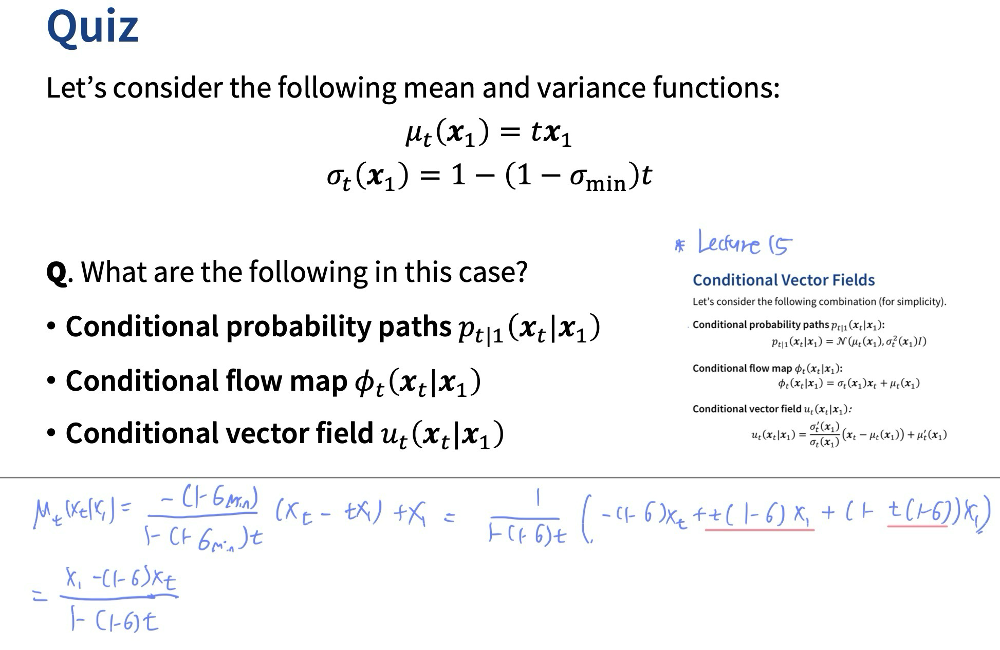


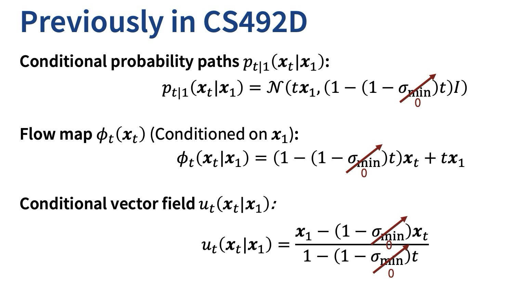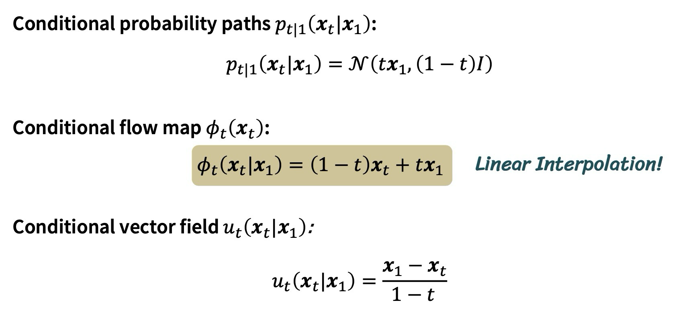
### 학습 단계! 
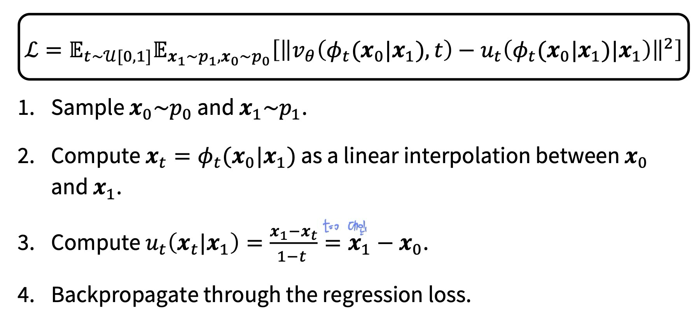
- ==픽셀의 변화량을 기준으로 학습시킴!== 

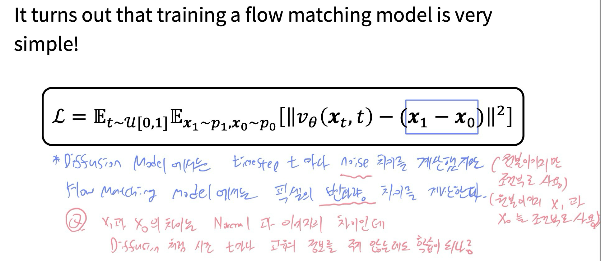

# Rectified Flow/ Reflow
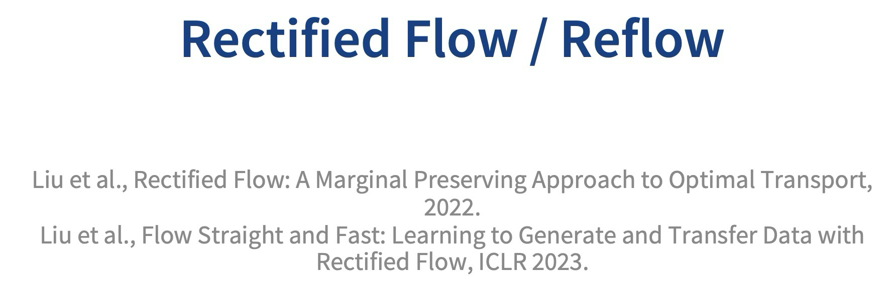

- 결과가 그리 좋지는 않다
	- vector field가 생성하는 경로가 겹치는 문제점 발생! 
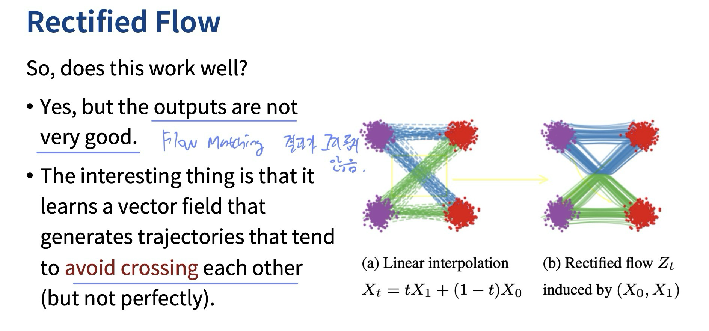

- 학습 시킨 Flow Based Model($Z_{1}$)을 사용해 $x_{0}, x_{1}$을 샘플링하여 다른 Flow Based Model을 학습시키자!  
 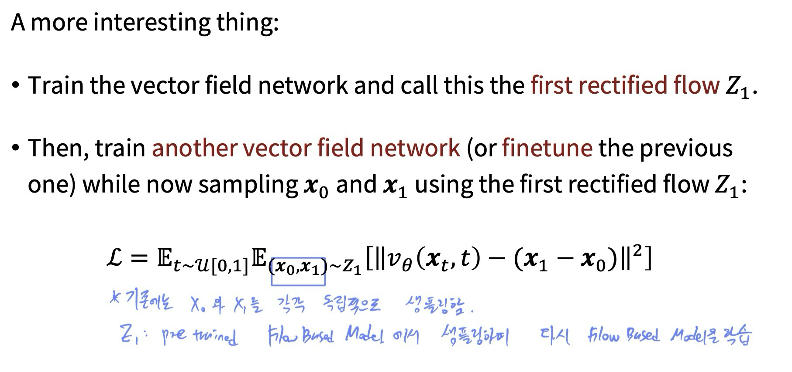
 - 더 경로가 직선화 됨 
	 - Loss 식이 경로의 직선화 정도를 측정하기 때문
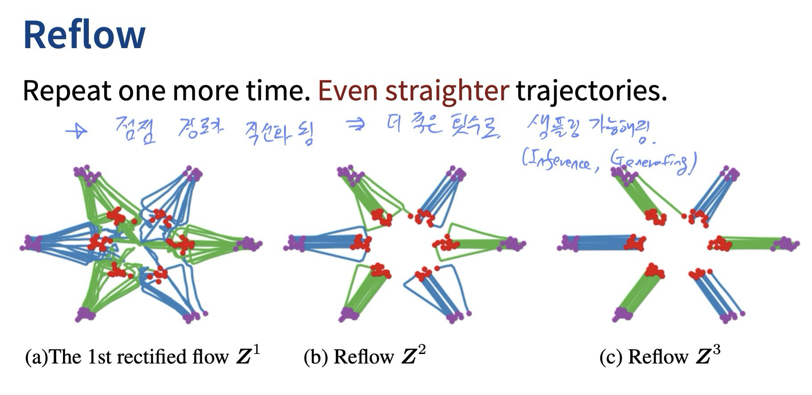
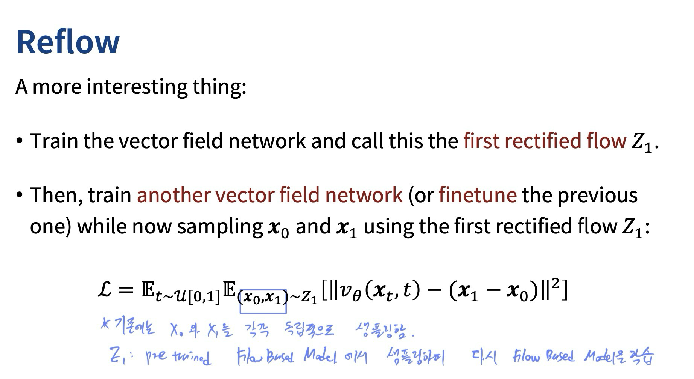


- Diffusion은 몇백번의 Step을 거쳐 생성하는 반면
  직선화된 경로를 사용하기에 One step으로 좋은 성능을 낸다. 
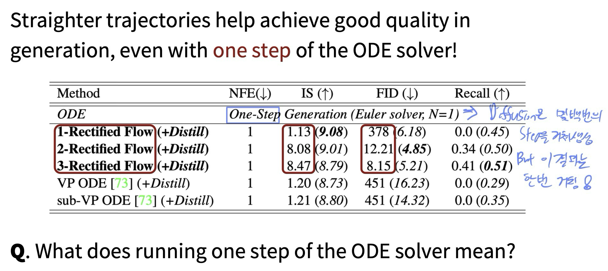
# InstaFlow
-  stable diffusion의 $x_{0}, x_{1}$ 을 사용하여 Flow Based Model을 학습시킴
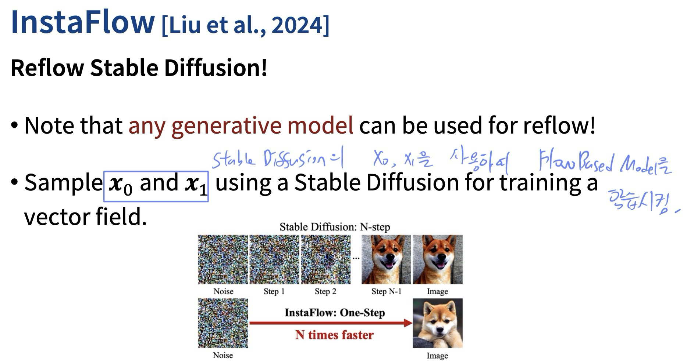


- 단점
	1. 생성 시간은 짧지만 퀄리티는 비교적 낮음
	2. 학습시 x_{0}, x_{1} 데이터가 필요하고 
	   경우에 따라 생성 모델을 추가로 학습시켜할 수 있음
	3. One step으로 생성하기에 conditional Generation 같은 task가 어려움
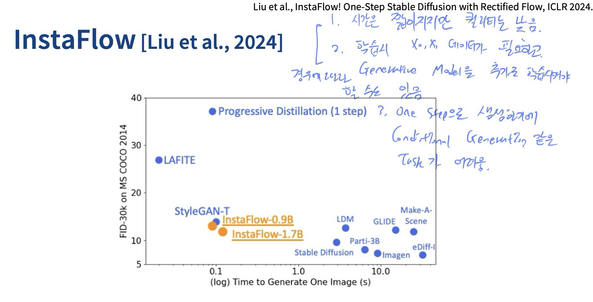

