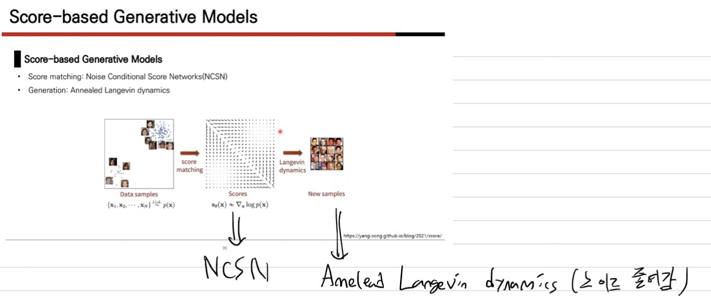
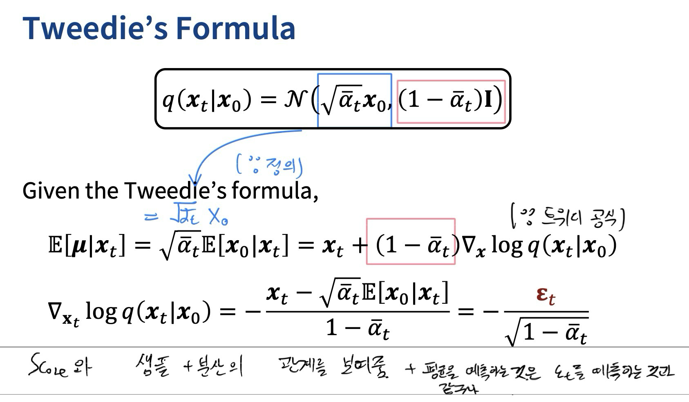
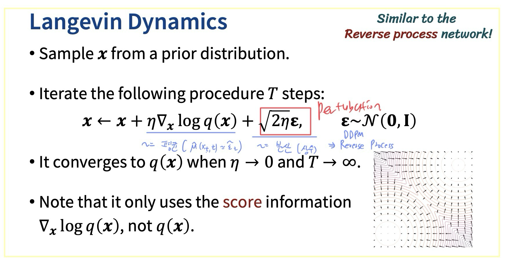
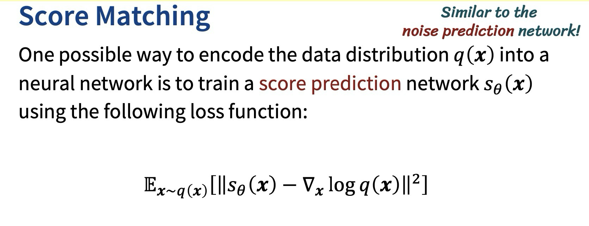
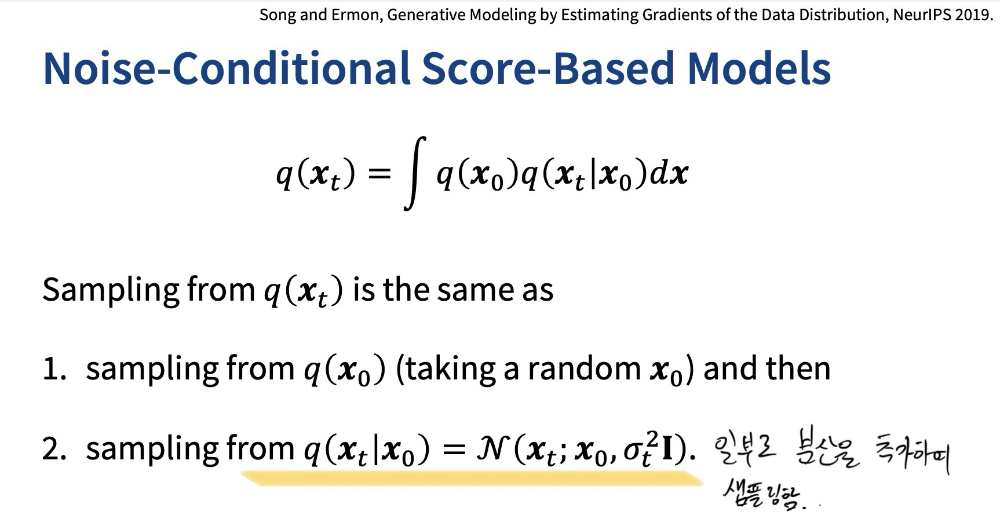
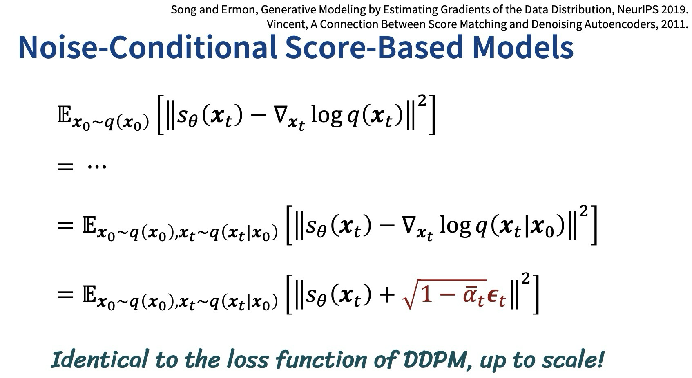
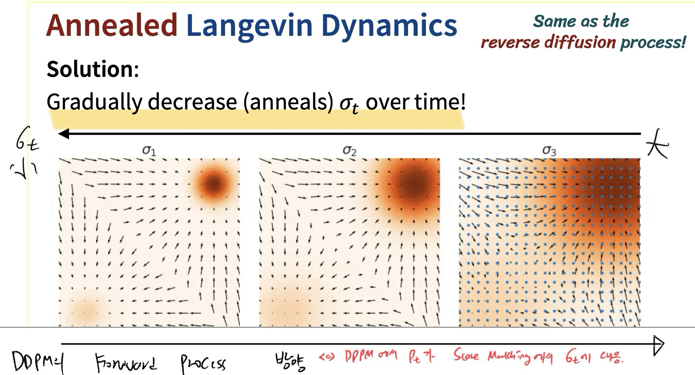
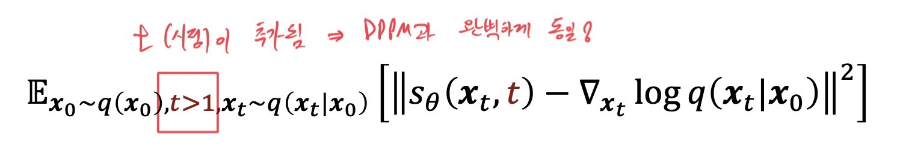

```table-of-contents
```

# DDPM


# Connection to Score-Based Models

> Score Based Model 참고 
> [Score-based Generative modeling Through Stochastic Differential Equations](../Score-based%20Generative%20modeling%20Through%20Stochastic%20Differential%20Equations/Score-based%20Generative%20modeling%20Through%20Stochastic%20Differential%20Equations.md)
### 이전 요약 
1. [Forward]  Score Matching으로 Data에서 Score를 만드는 Score Network 학습
2. [Backward] Langevin Dynamics로 Score에서 데이터를 생성 


### 시작 


- Score Function : PDF의 log likelihood의 gradient


1. $q(x_{t}|x_{0})$ 의 Score 
		
- 직접 PDF 미분 
2. $\epsilon_{t}$ 과의 관계 
	1. Forward Process를 $\epsilon_{t}$ 에 대한 식으로 변경 가능 
		-  ==즉, $\epsilon_{t}$ 를 예측하는 것은 score를 예측하는 것과 같음 ($\epsilon_{t}$ 는 score의 scaling 값)==
		  ==-> Score를 구해서 학습해보자!==  
	2.  정의 암기 
	   $${\epsilon_{t} = \nabla_{x_{t}} \frac{1}{\sqrt{1-\bar{\alpha_{t}}}}(x_{t} - \sqrt{\bar{\alpha_{t}}}x_{0})}$$
	
### Tweedie's Formula 
- 정의 : Sample과 분산 정보만 있다면 Sample을 조건으로 한 조건부 평균을 구할 수 있다. 


- (좌변)Tweedies's Formula 를 이용하여 
		$\mu$ = $\sqrt{\bar\alpha_{t}}x_{0}$ 
		$\Sigma$ = $(1-\bar\alpha_{t})I$ 를 대입   
- (우변) 위에서 score function + noise의 정의로 구한 식 
- 결론
	1. ==Score function의 새로운 정의== - ==조건부 평균값== 혹은 noise로 표현 가능 
	2. 조건부 평균을 예측하는 것은 noise를 예측하는 것과 같다.
		-  원본이미지 $x_{0}$ 와 $x_{t}$ 의 차이는 noise이기에 어떻게 보면 당연한 이야기 
		- <span style="background:rgba(5, 117, 197, 0.2)">단, 어떻게 샘플링을 하지?</span>
	- 

### Langevin Dynamics 
- 정의: 분포함수($q(x)$)를 몰라도 score function을 알면 Langevin Dynamics 를 통해 샘플링이 가능하다. 
- 아래의 과정을 거쳐 x를 업데이트 시켜줌 ~= ==DDPM Reverse Process==
	- score function ~= 평균 
	- epsilon ~= 분산
	- T번 반복하면 결국엔 샘플링 값의 분포는 q(x)로 수렴한다 




- 이렇게 데이터 생성에 필요한 Score를 위해 
  Score Prediction Network를 학습시키자! 


### Noise-Conditional Score-Based Models
- 어떻게 $q_(x_{t})$ 를 모르는데 Score $\nabla_{x}\log{q(x_{t})}$ 를 구할 수 있나? 
	-  가우시안 함수의 곱으로 추정 
	- ==여기서 $x_{t}$는 $x_{0}$에 $\sigma$ 만큼 noise가 추가된 것==


- 결국 Loss식에서 $q(x_{t})$ 를 조건부 함수인 $\log{q(x_{t} | x_{0})}$ 로 변경하는 것과 같아 변경! 
	- 결국 $\textcolor{orange}{q(x_{t})}$ 가 아니라 $\textcolor{orange}{q(x_{t} | x_{0})}$에서 샘플링 함!
	- 결국 ==두 Loss== 식이 같다는 것은 아래의 링크 참고
	  
```cardlink
url: https://process-mining.tistory.com/213
title: "NCSN 설명 (Noise conditional score network 설명)"
description: "NCSN은 noise conditional score network의 줄임말로, 데이터를 점점 더 작아지는 노이즈로 perturb함으로써 기존 score matching의 문제를 해결한 최초의 높은 성능의 score-based diffusion model이다. Yang Song의 Generative modeling by estimating gradients of the data distribution 논문에서 처음 제시된 개념으로, score-based diffusion model들의 가장 기본이 되는 모델이다. 이번 글에서는 이러한 NCSN이 무엇인지에 대해 알아보겠다. Recap 이 글을 이해하기 위해서는 score matching과 Langevin dynamics에 대한 이해가 필수적이다. 여기에서.."
host: process-mining.tistory.com
favicon: https://t1.daumcdn.net/tistory_admin/favicon/tistory_favicon_32x32.ico
image: https://img1.daumcdn.net/thumb/R800x0/?scode=mtistory2&fname=https%3A%2F%2Fblog.kakaocdn.net%2Fdn%2FbvybLZ%2FbtsGwxWR6TL%2FDr15f0gKiOJTkkNrQUK2e0%2Fimg.jpg
```


- 단 , 이때 분산이 작으면 
	- (단점) 원래 분포에서 변형 정도가 커지고
	- Score 또한 원래 분포의 Score와 차이가 생길 수 있음. 
	- (장점) 정교한 추정이 가능 
- 분산이 크면
	- (장점) 밀도가 낮은 지역에서 더 정확함 
	- (단점) 밀도가 높은 지역에서 덜 정확함 

### Annealed Langevin Dynamics
- 단점을 보완 
	- 점차 (anneals) $\sigma_{t}$ 를 감소시키자 
- DDPM과 비교
	- DDPM에서 $\beta_{t}$  = Score matching에서 $\sigma_{t}$ 
	- $\sigma_{t}$  : 점차 작아짐 
	- $\beta_{t}$ : 점차 커짐 


- Loss Function
	- t 시점이 추가되어 Score를 epsilon으로 바꾸면 DDPM과 완벽하게 동일한 Loss식 
	- 시간에 따라 다른 크기의 분산을 적용 



### Stochastic Differential Equations


# DDIM


