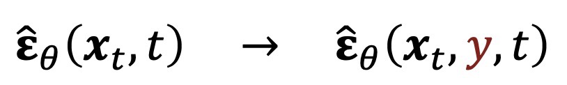
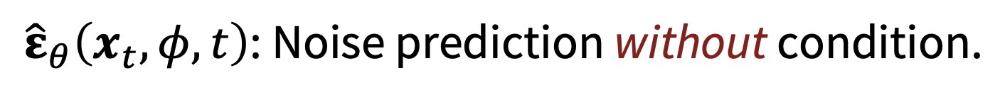
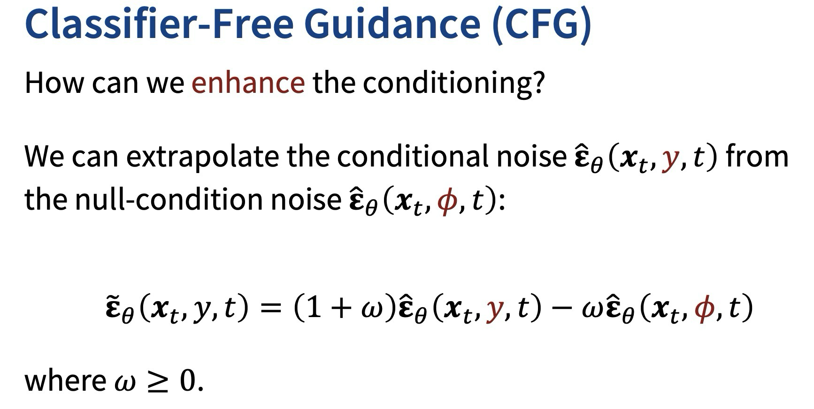
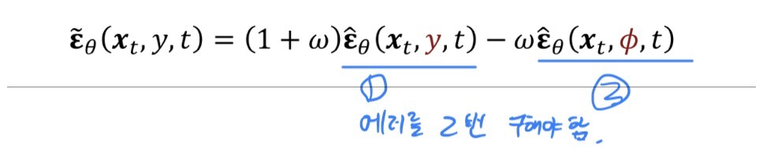

---
aliases:
  - Lecture 6 (DDIM//CFG)
---
```table-of-contents
```

# RECAP : DDPM vs DDIM


# Classifier-Free Guidance(CFG)

- conditional diffusion model을 만들기 위한 방법 중 하나
	- condition label = y를 input에 추가 
	- 
	- non-condition : null label $\phi$ 를 사용
	  

### conditioning을 개선
- 외삽법(extrapolate)을 이용


- 장점
	- 구현하기 쉽다
	- 다양하다 ; label 뿐 아니라 어떠한 추가적인 정보에도 사용될 수 있음(text 설명)
- 단점
	- noise predictor는 2번 evaluated 되어야한다. 
	  
