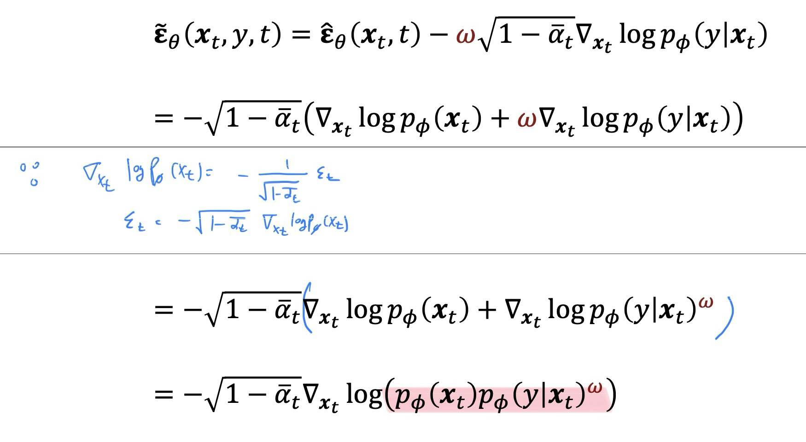

```table-of-contents
```

# Classifier Guidance / Classifier-Free-Guidance(CFG)
## Classifier Guidance
> Diffusion Models Beat GANs on Image Synthesis, NeurIPS 2021
- 가정 : data x와 class label y가 쌍으로 주어졌다고 가정 
  
- Score Function Remind! 
  추가로 $p(x_{t}) = q(x_{t} | x_{0})$ 로 정의
  
- Score Function(~= Noise)을 구하자! 
	- ${\nabla_{x_{t}} logp(y|x_{t})}$ 를 어떻게 구하나? 
		- Classification Network를 추가로 학습시키기 


- Loss Function(Noise)
	- classifier guidance (${\nabla_{x_{t}} logp(y|x_{t})}$)의 strength는 weight $w$ 로 조절
	  
	

- $w$가 클수록 class에 적합한 이미지를 생성

- 단점
	- classification Network를 추가로 학습시켜야함
	- 학습시키는 class의 개수가 많을 때 (1000개 이상) 성능이 떨어질 수 있음


## Classifier-Free Guidance(CFG)
- Null Label을 활용하여 conditional and unconditional diffusion을 함께 학습시킨다 
	- Null Label $\phi$ 는 0이나 다른 Integer로 설정 가능


- ==Score Function(~=Noise)==
	- Conditional Noise에 Null Condition noise를 Extrapolate(외삽법) 사용
	- ==결국 유도하면 Classifier Guidance의 Noise와 같다!== 


### Classifier Network 사용하지 않고 Classifier Guidance가 가능하다! 
- 아래는 수식적인 증명


![[image-128.png]]


- 상수를 곱해줌 
	- 위에서 본 Classifier Guidance와 동일함
![[image-129.png]]

![[image-131.png]]

- 장점
	- 구현하기 쉽다 (Encoder 하나만 추가하면 됨!)
	- 조건이 다양함 Ex) Class Label, text, image
	  Image to Image의 경우 text prompt, Image를 condition으로 제공
- 단점
	- Noise를 2번 예측해야함
- 예시
	- SD3
	- InstructPix2Pix (Image to Image)
	- Zero 1-to-3 (Image to 3D Object)
	- SALAD (Text to 3D)
	- InterHandGen (Hand to Hand)


### Negative Prompt
- Positive Prompt : High Resolution, 좋은 특성
- Negative Prompt : 부정적인 특성, Lower Resolution, blurry image
![[image-132.png]]


# Fine-Tuning-Based Methods

## Latent Diffusion 
- 고화질 이미지를 짧은 시간에 생성하기 위해 이미지를 압축하자! 
- AutoEncoder를 사용함
	- Latent Space = N(o,I)

![[image-133.png]]

- Image Encoder (VAE에서 사용하는 KL-Reg ) / Decoder(VQ-VAE에서 사용하는 VQ-Reg)는 Pretrained (빨간색)
	- 이때 AutoEncoder 학습 시 
	  Perceptual Loss(Feature map상의 거리) 
	  Patch-Based adversarial objective 사용
- Noise Predictor
	- Latent Space에서 학습됨
	- U-Net을 사용하고 각각의 Layer에 attention module이 사용됨
	- Q : 각각의 U-Net Layer의 output
	  K,V : input condition encoder의 output
	- 그렇게 Cross Attention을 거쳐 $z_{t}, t= T,T-1,T-2...$ 를 생성함
	- Denoising U-Net 
		- Input: t, $z_{t}$, $\tau(y)$ 
		- Output :  입력과 동일한 크기의 텐서를 출력하는데, 이 텐서가 바로 예측된 노이즈입니다. 
		  $\hat{z_{t}}$  = $\hat\epsilon_{t}$ (Diffusion은 입력 차원 = 출력 차원)
		  ![[image-137.png]]
	    그렇게 T-1 번 반복(U-Net + Attention)하여 예측된 노이즈를 실제 추가된 노이즈와 비교하여 손실을 최소화하는 방식으로 모델을 학습시킵니다
	  ![[image-135.png]]
		![[image-134.png]]
- 이후 DDPM Reverse Process를 통해 $\hat{z_{0}}$ 를 구해 Decoder를 거쳐 이미지 생성


## FID
- 이미지의 성능을 파악하는 중요한 척도 

### p-Wasserstein Distance
- 두 분포 사이의 거리를 측정

![[image-138.png]]
- 하나의 분포를 다른 분포와 같게 만들기 위해 옮겨야하는 면적 x 옮겨야하는 거리 
![[image-139.png]]

- 두 분포가 모두 정규분포이면 거리는 측정하는 공식이 정해짐
![[image-140.png]]


- Inception v3 network의 latent space에서 
  실제 / 생성된 이미지를 2-Wasserstein distance로 구하는데 
  이는 두 분포가 각각 정규분포라고 가정하는것 
- 단점
	- Inception v3 의 latent space로 매핑하는 것이 맞냐? 
	- 정규분포로 가정하는게 맞냐? 
![[image-141.png]]


- 실제 육안상 차이와 FID 차이가 일치하지 않음 
![[image-142.png]]

## 1. ControlNet
- 작은 개수(수천 개)의 이미지 쌍으로 Unconditional 모델을 Image conditional 모델로 변환시키자 

- 1. 왼쪽의 Stable Diffusion 의 Noise prediction Network는 Freeze 시키기
![[image-143.png]]


![[image-144.png]]


![[image-145.png]]


## 2. LoRA
- Fine tuning 시 적은 수의 parameter를 사용하여 학습!
- MLP == matrix 연산 후 activation function을 통과하는 것! 
	- 하나의 MLP Layer를 낮은 차원의 행렬곱 2개로 바꾸자 

![[image-146.png]]


![[image-147.png]]


![[image-148.png]]

## 3. 이외..
1. Adding Conditional Control to Text-to-Image Diffusion Models
2. DreamBooth
